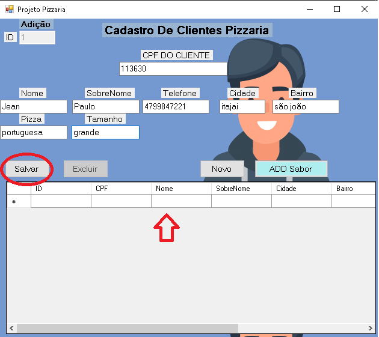
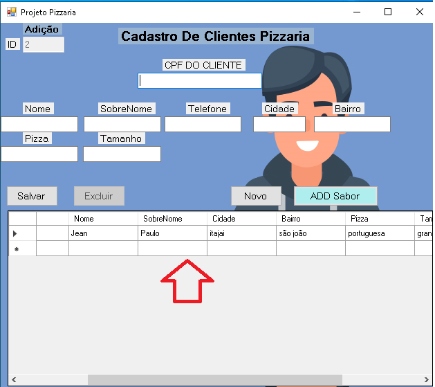
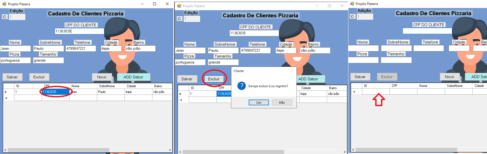

Olá, nesse projeto foi desenvolvido um crud no Visual Studio 2015 com linguagem <c#>

CRUD é a composição da primeira letra de 4 funções básicas de um sistema que trabalha com banco de dados:

✅ C: Create (criar) - criar um novo registro

👁 R: Read (ler) - ler (exibir) as informações de um registro

♻️ U: Update (atualizar) - atualizar os dados do registro

❌ D: Delete (apagar) - apagar um registro

Em resumo, CRUD é uma ação importante em vários cenários, sobretudo no uso de SQL e outras tecnologias da Ciência de Dados. É preciso ficar atento a cada função e aplicá-la da melhor maneira a fim de otimizar o tempo e garantir segurança e desempenho. 

Esse Crud Foi Desenvolvido Junto Com o Henrrique Arrais.

